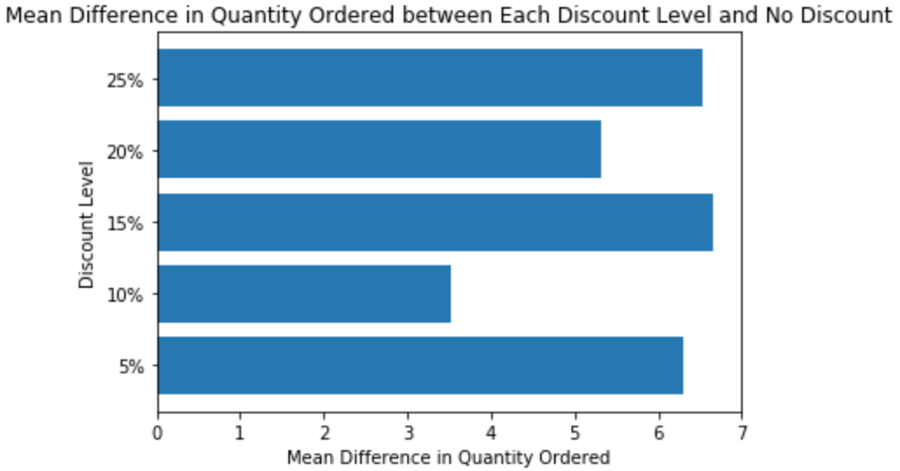
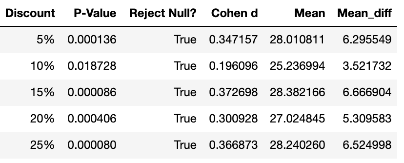
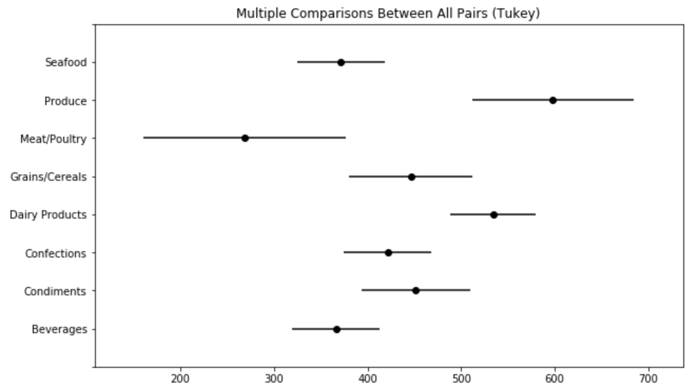
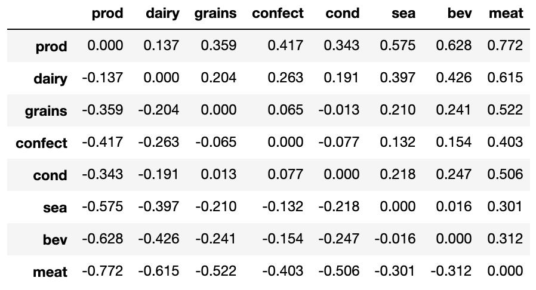
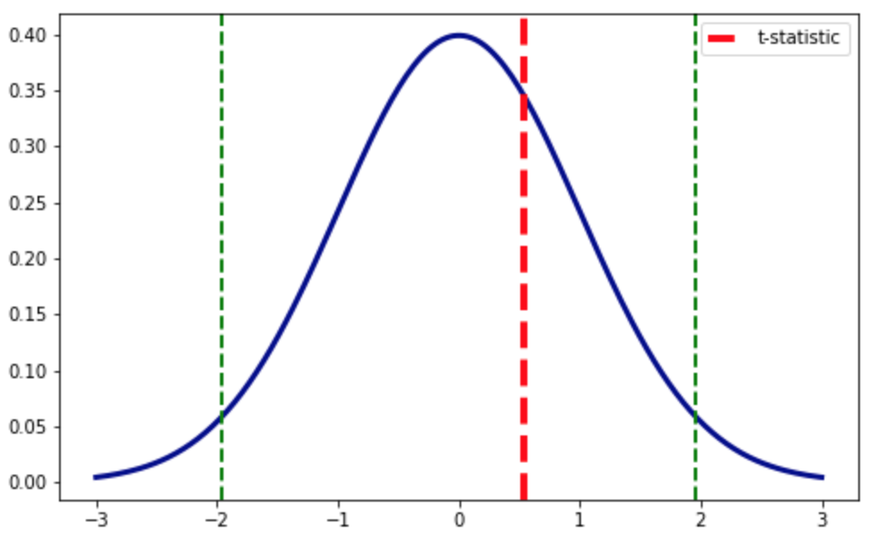
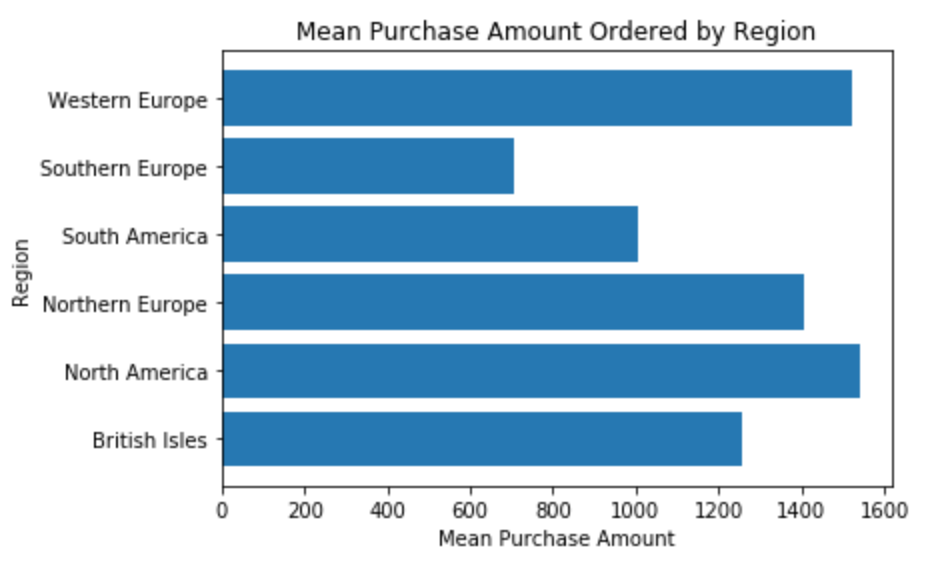
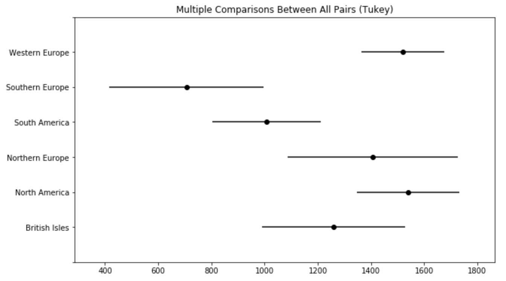

# Northwind Database Analysis

## Introduction

This is an analysis of the Northwind database, a free, open-source database about a fictional company created by Microsoft. The database contains sales data for a company that imports and exports specialty foods and includes information regarding employees, orders, products, etc. I will be using statistical analysis to gather important, relevant information for the company. What follows are my questions asked, hypotheses generated, an analyses conducted for this dataset.

## Question 1: Does discount amount have a statistically significant effect on the quantity of a product in an order? If so, at what level(s) of discount?

### Hypotheses

Null Hypothesis
> **Discounts do not have a statistically significant effect on the quantity of product ordered.**

Alternative Hypothesis
> **Discounts do have a statistically significant effect on the quanity of product ordered.**

I used an alpha value of `0.05` for a one-tailed Welch's T-Test.

### Results

For all discount levels (5%, 10%, 15%, 20%, and 25%) we can reject the null hypothesis, since each of their *p-values* are less than the alpha (`0.05`). 

**This means that every discount level has a statistically significant effect on the quantity of product ordered.** 

From our data, we can see that the 10% discount level has the smallest effect, where orders only have on average `3.5` more quantity ordered than non-discounted orders (`d = 0.196`), while the 15% discount level had the largest effect, where orders have on average `6.7` more quanity ordered than non-discounted orders. (`d = 0.373`).

## Question 2: Do some product categories generate more money per order for Northwind Traders than others?

### Hypotheses

Null Hypothesis
> **There is no statistical significance between the amount of money each product category generates per order.**

Alternative Hypothesis
> **Some product categories do make significantly more money per order than others.**

I used an alpha value of `0.05` in a Tukey's Range test (one-tailed).

### Results

#### Visualization of the results of the Tukey's Range Test

#### D-values between each of the categories

By basing our order off of the Cohen's d-value between the 'Produce' category and every other category, we get the following hierarchy:

1) **Produce** (Highest Average Cost per Order): \$598.10

2) **Dairy Products**: \$534.03

3) **Condiments**: \$451.62

4) **Grains/Cereals**: \$446.54

5) **Confections**: \$421.38

6) **Seafood**: \$371.66

7) **Beverages**: \$366.20

8) **Meat/Poultry** (Lowest Average Cost per Order): \$268.77

However, it should be remembered that most of the categories in the middle are not statistically different from each other, like 'Grains/Cereals', 'Confections', and 'Condiments'.

Even though Produce is likely the product category that makes the most money per order for the company, it has the second smallest amount of sales. Produce was sold in only 98 orders, while Dairy Products, Beverages, and Seafood each had over 325 orders. This is a huge area of potential growth for Northwind, and I recommend they start pushing employees to sell more produce.

## Question 3: Do employees in certain regions generate more money for the company than other employees in other regions?

### Hypotheses

Null Hypothesis
> **There is no statistical significance between the amounts generated by employees in each region.**

Alternative Hypothesis
> **Employees in some regions generate significantly more money than employees in other regions.**

I used an alpha value of `0.025` in a two-tailed Student's T-Test.

### Results

We can see that revenue generated per order by the two regions reponsible for selling Northwind's products, **North America** and the **British Isles**, is not statistically different, therefore we have failed to reject the null hypothesis. In the graph above, we can see that our t-statistic is between the positive and negative t-critical values, meaning that the one group doesn't sell statistically more or less than the other per order.

Using a two-tailed Student's T-Test, our resulting *p-value* was `0.59`, which is greater than our stated *alpha* value of `0.025`.

However, there is still some useful information that has come out of this test. We've established that each region generates the same amount of money per order, and after a quick look at the data, we can also see that each region has roughly the same number of employees (`5` in **North America** and `4` in the **British Isles**). Now, if we look at the number of sales made in each region, we can see that the number of sales coming out of **North America** (`586`) is over twice the number of sales coming out of the **British Isles** (`213`).

So though each region generates the same amount of money per order, we can see that the **North American** employees make more money for the company than their **British Isles** counterparts. I suggest Northwind look into incentive or training programs for their employees in the British Isles to help increase the number of sales they make.

## Question 4: Are there customer regions that purchase significantly more goods from Northwind Traders than others?

### Hypotheses

Null Hypothesis
> **There is no statistical significance between the amount purchased by each region.**

Alternative Hypothesis
> **Customers in some regions do purchase significantly more than customers in other regions.**

I will be using an alpha value of `0.05` in a Tukey's Range test (one-tailed).

### Results

We can reject the null hypothesis, since we've been able to show that there are in fact statistically significant differences between the amount each region purchases. What we can't do with our data is determine an order for which region purchases the most all the way down to which one purchases the least. The largest difference we discovered was between North America (with an average OrderCost of $1,540) and Southern Europe ($707). The Cohen's d-value between these two was 0.752, meaning there is a medium effect size between the two groups.

But this information is still useful. Looking again at the number of purchases per customer region, we can see that Southern Europe, which has the lowest mean OrderCost, and statistically speaking is in the bottom tier of customer regions, also has the second lowest number of purchases. Northwind could use this analysis to justify an increase in advertisements in that region of the world to try and get more customers.
